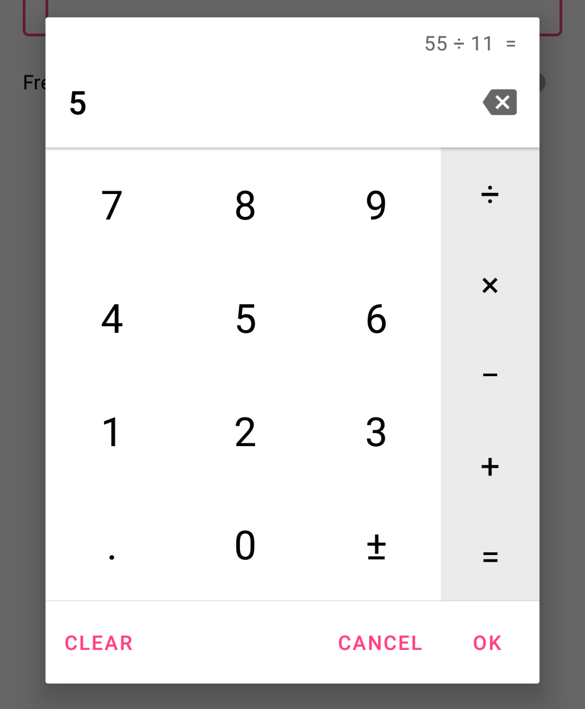

# Calculator dialog
[](https://opensource.org/licenses/Apache-2.0)
[](https://android-arsenal.com/api?level=22) 
[![Jitpack][download-badge]][download-link]

A fully customizable calculator dialog for Android.
Can be used to replace the numeric keyboard and useful to enter monetary amounts for example.

Is the fork of the [calcdialoglib by maltaisn](https://github.com/maltaisn/calcdialoglib).



## Features
- Material design with Google Material Components.
- Built-in light and dark theme support.
- Customizable number format.
- Calculator or phone numpad layout styles.
- Optional min and max values showing out of bounds messages.
- Entered expression can be shown and edited.
- Optional answer button to reuse previous result.
- Order of operations can be applied or not.
- Expression can be evaluated on new operator or not.
- Optional clear button.
- Entirely customizable using custom attributes.

## Gradle
To get a library into your build:
* Add the JitPack repository to your **root** `build.gradle` at the end of repositories:
```groovy
allprojects {
    repositories {
        ...
        maven { url 'https://jitpack.io' }
    }
}
```
* Add the dependency to your **app's** `build.gradle`:
```groovy
dependencies {
    ...
    implementation 'com.github.inbalboa:calcdialoglib:vX.Y.Z'
}
```
Replace `vX.Y.Z` with this version number: [![Jitpack][download-badge]][download-link]

## Tutorial
- Get started on the wiki page [Using the dialog](https://github.com/inbalboa/calcdialoglib/wiki/Using-the-dialog).
- Customize the dialog's behavior by [changing its settings](https://github.com/inbalboa/calcdialoglib/wiki/Calculator-settings).
- Learn how to [style the dialog](https://github.com/inbalboa/calcdialoglib/wiki/Styling-the-calculator) with the attributes

## Changelog
View [changelog](CHANGELOG.md) for release notes.

[download-badge]: https://img.shields.io/jitpack/v/github/inbalboa/calcdialoglib
[download-link]: https://jitpack.io/#inbalboa/calcdialoglib
