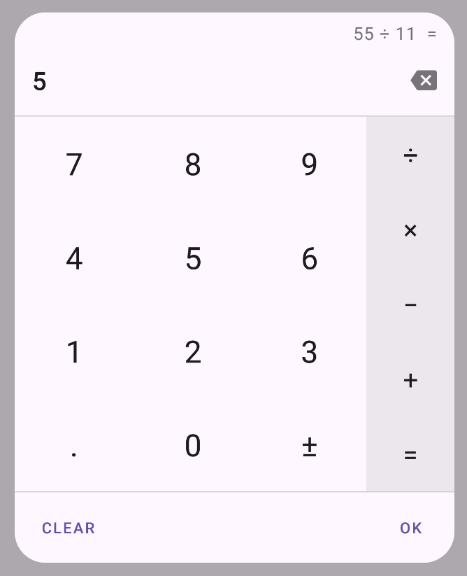

# Calculator dialog
[](https://jitpack.io/#inbalboa/calcdialoglib)

A fully customizable calculator dialog for Android compatible with API 22.
Can be used to replace the numeric keyboard and useful to enter monetary amounts for example.

Is the fork of the [calcdialoglib by maltaisn](https://github.com/maltaisn/calcdialoglib).



#### Features
- Material design with Google Material Components.
- Built-in light and dark theme support.
- Customizable number format.
- Calculator or phone numpad layout styles.
- Optional min and max values showing out of bounds messages.
- Entered expression can be shown and edited.
- Optional answer button to reuse previous result.
- Order of operations can be applied or not.
- Expression can be evaluated on new operator or not.
- Optional clear button.
- Entirely customizable using custom attributes.

### How to
To get a library into your build:
* Add the JitPack repository in your root build.gradle at the end of repositories.
```groovy
allprojects {
    repositories {
        ...
        maven { url 'https://jitpack.io' }
    }
}
```
* Add the dependency to your app build.gradle.
```groovy
dependencies {
    ...
    implementation 'com.github.inbalboa:calcdialoglib:v1.0.0'
}
```

## Tutorial
- **Get started on the wiki page [Using the dialog](https://github.com/inbalboa/calcdialoglib/wiki/Using-the-dialog).**
- Customize the dialog's behavior by [changing its settings](https://github.com/inbalboa/calcdialoglib/wiki/Calculator-settings).
- Learn how to [style the dialog](https://github.com/inbalboa/calcdialoglib/wiki/Styling-the-calculator) with the attributes

### Changelog
View [changelog](CHANGELOG.md) for release notes.
